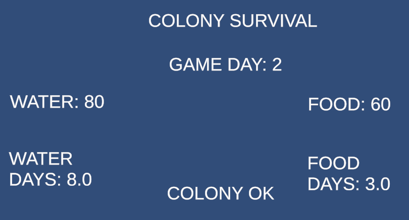

# Colony Survival Prototype

A small colony survival simulation prototype built in Unity.

The prototype demonstrates data-driven configuration using JSON, a pure C# simulation layer, Unity UI integration, automatic game-day progression, and EditMode unit testing.

## Unity Version

Unity 2022.3.62f1

## How to Run

1. Open the project in Unity.
2. Open the `ColonySurvival` scene.
3. Press Play.
4. The simulation automatically advances by one game day every real-time second.

## Simulation

The colony tracks:

- Villager count
- Food
- Water
- Food consumption
- Water consumption
- Current game day

Each game day:

- Food is consumed based on the number of villagers.
- Water is consumed based on the number of villagers.
- Resources cannot fall below zero.
- The game day counter increases by one.

The colony is considered starving when either food or water reaches zero.

## Configuration

Simulation starting values and consumption rates are stored in JSON configuration files.

### Population Configuration

`population.json` contains:

- Villager count
- Starting food
- Starting water

### Consumption Configuration

`consumption.json` contains:

- Food consumed per villager per day
- Water consumed per villager per day

These values are loaded at runtime and passed into the simulation.

No simulation values such as population, starting reserves, or consumption rates are hardcoded in the simulation logic.

## Architecture

The project separates simulation logic from Unity-specific behaviour.

```text
JSON Configuration
        ↓
Configuration Data Classes
        ↓
ColonySimulation
        ↓
ColonyGameManager
        ↓
Unity UI
## Screenshots

### Gameplay



### Unit Tests


## Demo Video

[Watch the Colony Survival Prototype Demo](https://drive.google.com/file/d/1lYtdWFytkJxLoJUyMQb7been-KhtrESp/view?usp=sharing)

## Testing

The core simulation logic is covered by EditMode unit tests.

The following tests pass successfully:

- `AdvanceDay_DeductsCorrectFoodAndWater`
- `DaysRemaining_IsCalculatedCorrectly`
- `Starving_WhenEitherReserveReachesZero`

All 3 tests pass successfully.

## Design Decisions

- Simulation logic is separated from Unity-specific behaviour.
- JSON is used for configuration so simulation values can be changed without modifying the core simulation code.
- The simulation layer is implemented as a pure C# class, making it easier to test independently.
- Unity is responsible for UI updates and game-time progression.
- Resources are clamped to zero to prevent negative food or water values.
- Game days advance automatically every real-time second for demonstration purposes.

## Project Structure

```text
Assets/
├── Config/
│   ├── population.json
│   └── consumption.json
│
├── Scenes/
│   └── ColonySurvival.unity
│
├── Scripts/
│   ├── Core/
│   │   └── ColonySimulation.cs
│   │
│   ├── Data/
│   │   ├── PopulationConfig.cs
│   │   └── ConsumptionConfig.cs
│   │
│   └── Unity/
│       └── ColonyGameManager.cs
│
└── Tests/
    └── Editor/
        └── ColonySimulationTests.cs